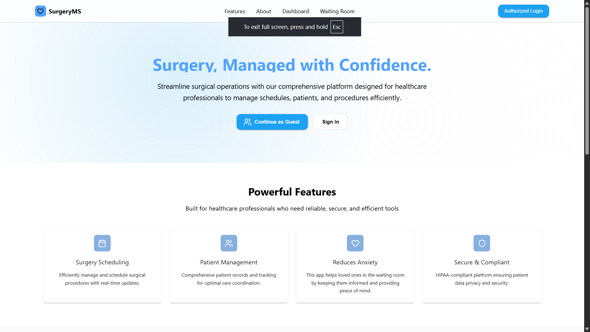

## Project info

**URL**: [Surgery Update Board](https://v56-tier3-team-35-hne8.vercel.app)

**Key Features**:
- Real-time surgery status updates
- Patient information display with privacy controls
- Mobile-responsive design for various screen sizes
- Automatic data refresh using short polling
- Status-based color coding (scheduled, in-progress, completed, delayed, cancelled)
- Pagination for large patient lists
- Live clock display

**Screen Shots**



## Test Accounts
For testing purposes, use the following credentials:

**Admin Account:**
- Email: bureck400@gmail.com
- Password: dummyPassword124


## What technologies are used for this project?

This project is built with:

- Vite
- TypeScript
- React
- Material UI
- Supabase
- Tailwind CSS

## Frontend Setup

### Install Dependencies

```bash
cd frontend
npm install
```

### Environment Variables

Create a `.env` file in the `frontend` directory with the following content (replace values as needed):

```
VITE_BACKEND_URL=your_backend_url
```

- `VITE_BACKEND_URL`: URL of your backend server

### Run the Frontend (Development)

```bash
npm run dev
```

Starts the frontend development server (usually at http://localhost:5173).

### Build for Production

```bash
npm run build
```

Builds the frontend for production (output in the `dist` folder).

## Backend Setup

### Install Dependencies

```bash
cd backend
npm install
```

### Environment Variables

Create a `.env` file in the `backend` directory with the following content (replace values as needed):

```
PORT=3000
SUPABASE_URL=your_supabase_url
SUPABASE_KEY=your_supabase_service_role_key
FRONTEND_URL=your_frontend_url
```

- `PORT`: Port number for the backend server (default: 3000)
- `SUPABASE_URL`: Your Supabase project URL
- `SUPABASE_KEY`: Your Supabase service role key
- `FRONTEND_URL`: frontend url for cors config

### Run the Server (Development)

```bash
npm run dev
```

Starts the backend server with hot reloading for development.

### Run the Server (Production)

```bash
npm run build
npm run start
```

Builds the project and starts the production server.

## Our Team
- 
- Niamh Brown: [GitHub](https://github.com/NiamhBrown) / [LinkedIn](https://www.linkedin.com/in/niamh-brown1/)
- Venkata Santhosh: [GitHub](https://github.com/BVSanthosh) / [LinkedIn](https://www.linkedin.com/in/venkata-santhosh-basina/)
- Nsowah Alexander: [GitHub](https://github.com/recklessbud) / [LinkedIn](https://linkedin.com/in/liaccountname)
- Evaristo Caraballo: [GitHub](https://github.com/evaristoc)
